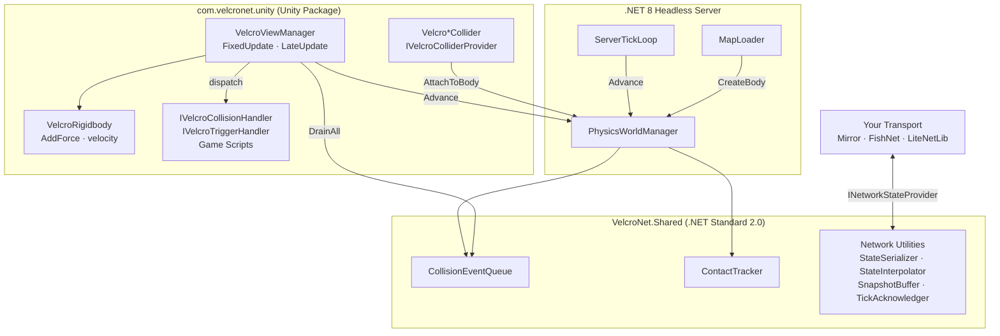

<div align="center">
  <h1>⚡ VelcroNet</h1>
  <p><strong>GC-free, deterministic 2D physics for server-authoritative Unity games</strong></p>

  <p>
    
    
    
    
    
  </p>
</div>

---

## What is VelcroNet?

VelcroNet completely decouples 2D physics simulation from Unity's native engine. A single, deterministic physics loop powered by [Aether.Physics2D](https://github.com/nkast/Aether.Physics2D) (a pure C# Box2D port, actively maintained) runs identically on a headless .NET 8 server and a Unity client — with zero runtime heap allocation.

Unity is used strictly as a visual layer. There are no `Rigidbody2D` components, no `Physics2D.Simulate` calls, and no GC pressure from the physics tick. This makes VelcroNet the right foundation for server-authoritative multiplayer games where client and server must agree on physics state down to the bit.

---

## Features

- ⚡ **Zero runtime GC allocation** — flat memory profile during gameplay, pre-allocated parallel arrays throughout
- 🎯 **100% deterministic fixed-timestep simulation** — accumulator-based tick ensures identical results on server and client
- 🖥️ **Headless .NET 8 server** — no Unity license required on the game server; loads baked map files directly
- 💥 **Unity-style collision callbacks** — `OnCollisionEnter`, `OnCollisionExit`, `OnTriggerEnter`, `OnTriggerExit` via interface dispatch (no reflection)
- 💪 **Full force API** — `AddForce`, `AddTorque`, `AddForceAtPosition` with `ForceMode` (Force, Impulse, VelocityChange, Acceleration)
- 🏗️ **Editor baking workflow** — design levels visually in Unity, export to JSON for the headless server
- 🔍 **Physics queries** — `Raycast`, `OverlapCircle`, `OverlapBox` with zero-alloc result buffers
- 🔗 **Transport-agnostic networking** — bring your own transport; plug in Mirror, FishNet, LiteNetLib, or raw sockets
- 🎨 **Scene View gizmos** — collision shapes drawn in the Unity Scene View without native Physics components
- 💤 **Body sleep management** — optional broad-phase deactivation for distant bodies
- 🔒 **Rigidbody constraints** — `FreezePositionX/Y`, `FreezeRotation` applied post-step, no drift

---

## Architecture



---

## Quick Start — Unity

### 1. Install

**Via Unity Package Manager (recommended)**

In Unity: **Window → Package Manager → + → Add package from git URL**, then paste:
```
https://github.com/adielmag/VelcroNet.git?path=unity/com.velcronet.unity#upm
```

The `#upm` branch is published automatically by CI on every release and ships with the pre-built `VelcroNet.Shared.dll` and `Aether.Physics2D.dll` so the package works out of the box.

To pin a specific version, use the `upm/v*` tag (one is created per release):
```
https://github.com/adielmag/VelcroNet.git?path=unity/com.velcronet.unity#upm/v0.1.0
```

**Manual** — download a release tarball from [Releases](https://github.com/adielmag/velcronet/releases) and extract `unity/com.velcronet.unity` into your project's `Packages/` folder.

### 2. Scene Setup

1. Create an empty GameObject, add **VelcroNet → View Manager**.
2. On your entity prefabs, add **VelcroNet → Rigidbody** and one of **VelcroNet → Box / Circle / Polygon Collider**.
3. Bake the scene: **VelcroNet → Bake Scene to JSON** (saves a `MapData.json` for the server).

### 3. Force and Physics

```csharp
using VelcroNet;

public class PlayerController : MonoBehaviour, IVelcroCollisionHandler, IVelcroTriggerHandler
{
    private VelcroRigidbody _rb;

    void Awake() => _rb = GetComponent<VelcroRigidbody>();

    void Update()
    {
        if (Input.GetKey(KeyCode.Space))
            _rb.AddForce(Vector2.up * 500f, ForceMode.Impulse);
    }

    // ── Unity-style callbacks ────────────────────────────────────────
    public void OnCollisionEnter(ref CollisionData data)
        => Debug.Log($"Collided with entity {data.EntityIdB}");

    public void OnCollisionExit(ref CollisionData data) { }

    public void OnTriggerEnter(ref TriggerData data)
        => Debug.Log($"Entered trigger from entity {data.OtherEntityId}");

    public void OnTriggerExit(ref TriggerData data) { }
}
```

### 4. Physics Queries

```csharp
using VelcroNet;
using VelcroNet.Queries;

var results = new RaycastHit[8];
int count = VelcroPhysicsQueries.Raycast(
    origin:    transform.position,
    direction: Vector2.right,
    distance:  10f,
    results:   results);

for (int i = 0; i < count; i++)
    Debug.Log($"Hit entity {results[i].EntityId} at {results[i].Point}");
```

---

## Quick Start — Headless Server

```bash
cd src/VelcroNet.Server
dotnet run -- maps/level01.json
```

The server loads the baked `level01.json`, runs the physics loop at 60 Hz, and calls your `INetworkStateProvider.OnTickComplete` each tick.

```csharp
var world  = new PhysicsWorldManager(WorldConfig.Default);
var loader = new MapLoader();
loader.LoadInto(world, "maps/level01.json");

var loop = new ServerTickLoop(world);
loop.SetSnapshotCallback((states, count, tick) =>
{
    // Serialize and broadcast via your transport
    int bytes = StateSerializer.Serialize(states, count, sendBuffer, 0);
    myTransport.BroadcastUnreliable(sendBuffer, bytes);
});

loop.Run(CancellationToken.None);
```

---

## Networking

VelcroNet provides **contracts and utilities**, not a bundled transport:

| Type | Purpose |
|---|---|
| `INetworkStateProvider` | Hook into the tick loop — implement to broadcast state |
| `StateSerializer` | Zero-alloc binary write/read of `EntityState[]` arrays |
| `StateInterpolator` | Client-side snapshot lerp — smooths 20 Hz network updates to 144 Hz render |
| `SnapshotBuffer` | Circular buffer of authoritative snapshots |
| `TickAcknowledger` | Bitmask-based ack tracking for delta compression |
| `NetworkObjectPool` | Pre-warmed pool of entity GameObjects — no `Instantiate` at runtime |

See **[`examples/LiteNetLibExample/`](examples/LiteNetLibExample/)** for a complete working implementation using LiteNetLib — server broadcaster + Unity client bridge with interpolation.

---

## Performance Guidelines

VelcroNet enforces these rules internally. Follow them in your own game code too:

- **No LINQ in hot paths.** Use raw `for` loops in Update, FixedUpdate, physics callbacks.
- **No `GetComponent` at runtime.** Cache all component references in `Awake`.
- **Never feed `Time.deltaTime` to physics.** `VelcroViewManager` pins `Time.fixedDeltaTime` to `SimulationConstants.FixedTimestep` and uses the accumulator exclusively.
- **Pass large structs by `in` or `ref`.** CollisionData, TriggerData, BodyDef — never copy by value in hot code.
- **One `SetPositionAndRotation` call per body per frame.** `VelcroViewManager` batches all transform writes in a single `LateUpdate` loop.
- **Pre-allocate result buffers.** `PhysicsQueryBuffer` and `NetworkObjectPool` are created once and reused indefinitely.

---

## Contributing

1. Fork the repo and create a branch: `feature/your-feature` or `fix/issue-description`.
2. All changes to `VelcroNet.Shared` must pass `dotnet test`.
3. PR checklist:
   - [ ] `dotnet build VelcroNet.sln` with no errors or warnings
   - [ ] `dotnet test` — all tests green, determinism tests pass
   - [ ] No new GC.Alloc in hot paths (Unity Profiler / BenchmarkDotNet)
   - [ ] New public API documented with XML summary comments

---

## License

[MIT](LICENSE) — free to use in commercial and open-source projects.
